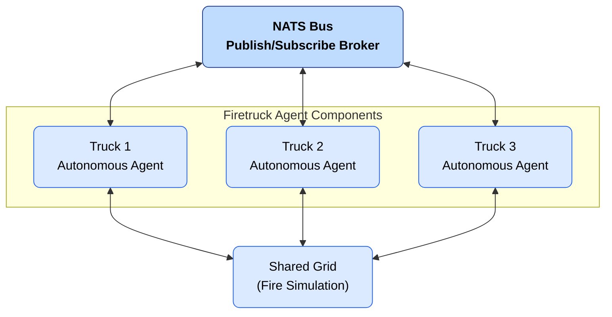

# Lab 2 – Fighting Fire with Distributed Messaging  
Course: DIT357 – Distributed Systems  
Authors: Qutaiba Adnan, Bouali Boujerad, Vijaykrishnan Gopalakrishnan  

---

## Overview
This project implements a distributed firefighting simulation in **Go**, using **NATS** as a message broker for asynchronous communication and coordination. Multiple autonomous firetrucks cooperate over a shared grid to extinguish fires without any central controller. Each firetruck operates as an **independent distributed process**, capable of making local decisions, exchanging messages using **publish–subscribe messaging**, and synchronizing access to shared resources (water) using **Lamport logical clocks**. Through this mechanism, the system ensures **mutual exclusion**, **fairness**, and **causal ordering** of events in a fully decentralized environment. This implementation fulfills Tasks 0–3 of the official 
*Lab 2 – Fighting Fire* assignment.

---

## Technologies Used
- Programming Language: **Go 1.21+**  
- Messaging System: **NATS**  
- Coordination: **Lamport Logical Clocks**
  
---
##  Prerequisites

- **Go 1.21+**
- **Docker** (for running NATS locally)

## Installation and Setup
You can set up and run the simulation using the following commands step-by-step:

```bash
# 1. Clone the repository
git clone https://github.com/Qutaiba-Adnan/Lab2.git
cd Lab2

# 2. Install Go dependencies
go mod tidy

# 3. Start the NATS server (using Docker)
docker run --name nats -p 4222:4222 -p 8222:8222 -d nats:latest

# 4. Verify that NATS is running
docker ps | grep nats

# 5. Run the simulation
export NATS_URL="nats://localhost:4222"
go run .

```

---

## System Architecture
### Components
| Component | Description |
|------------|-------------|
| `grid.go` | Represents the simulation grid and fire propagation logic. |
| `firetruck.go` | Implements firetruck behavior: movement, water requests, and message handling. |
| `cheif.go` | Simulates a supervising unit that can detect truck failures or assign tasks. |
| `water.go` | Defines message types: `WaterRequest`, `WaterReply`, and `WaterRelease`. |
| `naming.go` | Provides unique identifiers for trucks and fires. |
| `nats.go` | Manages NATS connectivity, publishing, and subscription utilities. |
| `main.go` | Entry point; initializes the grid, connects to NATS, and runs the simulation loop. |

### Architecture Diagram



---

## Task Mapping
### Task 0 – Simulation Environment
- A 20×20 grid represents the environment.  
- Fires ignite and spread randomly.  
- Firetrucks are placed on the grid and move one cell each simulation step to extinguish fires.  
- Each simulation step prints the updated grid and actions.  

### Task 1 – Communication Backbone
- Implemented using **NATS** as an asynchronous publish–subscribe system.  
- Trucks communicate through structured JSON messages.  
- The `nats.go` module provides `PublishJSON` and `SubscribeJSON` utilities for message exchange.  

### Task 2 – Coordination with Logical Clocks
- Each firetruck maintains its own **Lamport timestamp**.  
- Trucks coordinate water access through message passing based on timestamps.  
- Follows the **Ricart–Agrawala** mutual exclusion protocol for fairness.  
- Message logs show timestamp-based ordering and access approval.  

### Task 3 – Distributed Strategy and Naming
- Trucks make decisions independently without a central controller.  
- Each truck is assigned a unique name such as `truck-1`, `truck-2`, etc. (flat-naming scheme)  
- Coordination relies entirely on decentralized message exchange.  
- Failure simulation demonstrates robustness in distributed coordination.  

---


